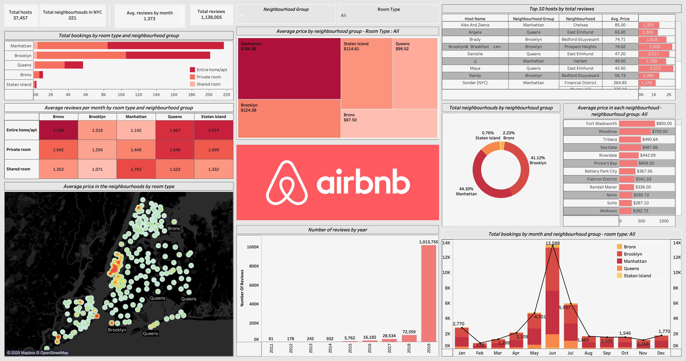

# 📊 New York City Airbnb Analysis Dashboard

This Tableau dashboard explores key patterns in Airbnb listings across New York City. Using interactive visualizations, the project uncovers neighborhood-level trends, pricing behavior, host engagement, and availability insights to better understand how short-term rentals impact NYC’s housing and tourism landscape.

## 📍 Dashboard Objectives:
- Analyze the distribution of listings by neighborhood and room type
- Examine price variation across boroughs
- Identify top-reviewed listings and hosts
- Explore trends in listing availability and review activity over time

## 🔑 Key Insights:
- **Manhattan** dominates the Airbnb market in terms of price and listing volume, especially for private rooms and entire homes.
- **Brooklyn** shows a wider range of affordable options, often appealing to longer-term travelers.
- Listings with **more than 50 reviews** tend to maintain **higher visibility and occupancy**.
- **Most listings** are only available for **less than half the year**, indicating either seasonal hosting or part-time rentals.

## 📊 Tools Used:
- Tableau Desktop
- NYC Airbnb Open Data (Inside .twbx)
- Public dataset via [Inside Airbnb](http://insideairbnb.com/)

## 🖼️ Dashboard Preview:

## 📁 How to Use:
Clone the repository and open the `.twbx` file in Tableau Public or Tableau Desktop to explore the interactive visualizations.

